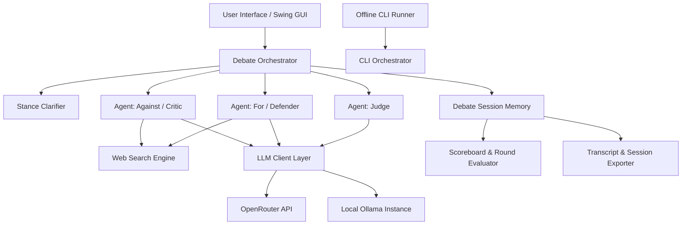
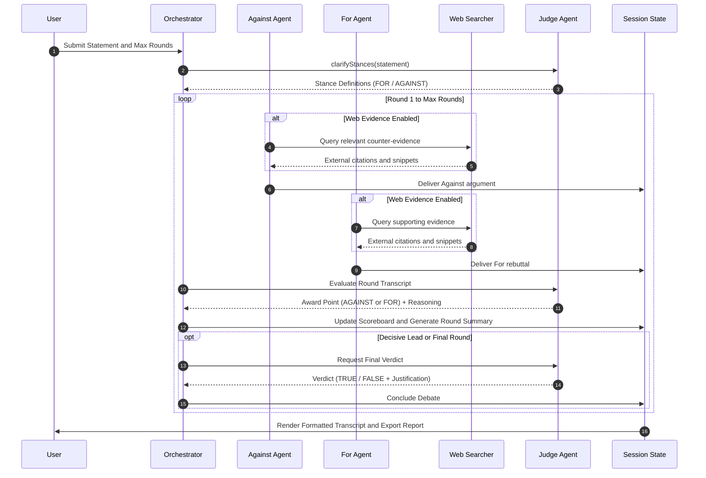

# jLLMDebateRoom

Multi-agent adversarial debate orchestrator built in standard Java (JDK 17+) with Swing GUI and standalone CLI interfaces. The engine orchestrates structured debates between opposing AI personas and adjudicates outcomes through a judicial scoring system.

## System Architecture



## Debate Protocol



## Directory Structure

```
jLLMDebateRoom/
|-- Courtroom.java              # Main Swing application and orchestrator core
|-- TestCourtroom.java          # Diagnostic and regression test suite
|-- run.sh                      # Unix build and execution launcher
|-- run.bat                     # Windows build and execution launcher
|-- check.sh                    # Unix configuration and model diagnostic script
|-- check.bat                   # Windows configuration diagnostic script
|-- diag.sh                     # Headless runtime logger for diagnostics
|-- diag-run.bat                # Windows headless diagnostic launcher
|-- config.properties.example   # Configuration template for provider settings
|-- .env.example                # Environment template for API keys
|-- .gitignore                  # Security rules ignoring keys, logs, and artifacts
|-- docs/                       # Technical documentation and audits
|   `-- DEVIL_REPORT.md         # Adversarial architecture audit
|-- offline/                    # Standalone CLI mode
|   |-- CourtroomCLI.java       # Pure console debate engine
|   |-- run_offline.sh          # Unix CLI execution script
|   |-- run_offline.bat         # Windows CLI execution script
|   `-- README.md               # Offline mode usage instructions
`-- sessions/                   # Generated debate logs and session exports
```

## Requirements

- Java Development Kit (JDK 17 or later)
- Local Ollama daemon running on `http://localhost:11434` (optional for local models)
- OpenRouter API key (optional for cloud models)

## Setup and Configuration

Copy the sample configuration and environment templates:

```bash
cp .env.example .env
cp config.properties.example config.properties
```

Populate `OPENROUTER_API_KEY` inside `.env` for cloud inference. If left empty, the application defaults to local Ollama endpoints.

## Compilation and Execution

### Graphical Interface

#### Linux / macOS
```bash
chmod +x run.sh check.sh diag.sh
./run.sh
```

#### Windows
```cmd
run.bat
```

### Standalone CLI Execution

For headless or offline environments using local Ollama instances:

```bash
cd offline
chmod +x run_offline.sh
./run_offline.sh qwen2.5
```

## Automated Test Suite

Execute the regression test suite covering JSON serialization, persona prompt integrity, scoring thresholds, and summarization limits:

```bash
javac -d out Courtroom.java TestCourtroom.java
java -cp out TestCourtroom
```
